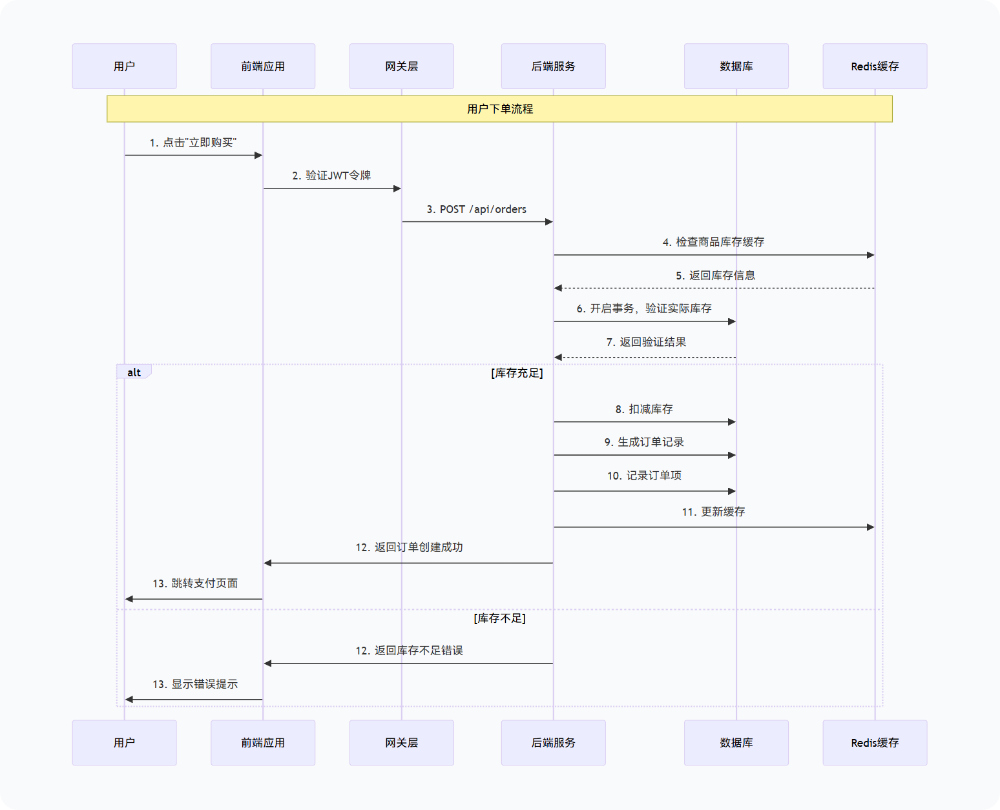
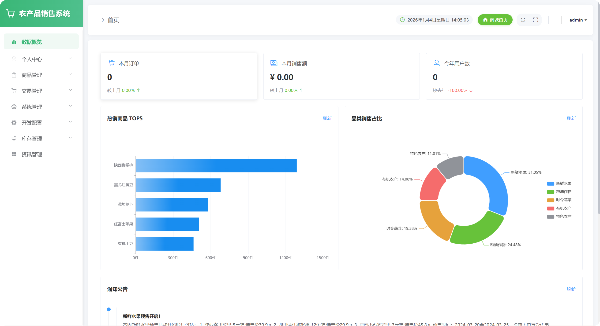
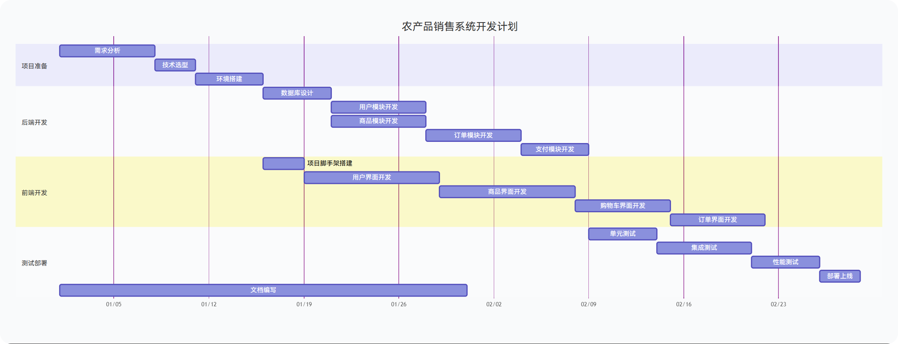

# 🌾 农产品销售系统 (Agricultural Products Sales System)


  

> **👨‍💻 开发者致辞**

>

> 本项目由一名热衷技术和探索编程宇宙的开发者 *(自嘲摆兵)* 基于 BootVue技术栈的==农副产品项目脚手架==深度定制开发。作为我的大二期末课程设计的优秀课题，我对于它的定位不仅是一个本学期BootVue技术栈项目实践成果，也是通过 GitHub对此课设作业 进行了长期的迭代与精细化管理。

>

> **⚠️ 学术声明**：本仓库包含的源代码和文档仅供**学术交流与研究**（如课程设计、毕业设计参考），严禁用于商业用途或直接抄袭提交。

  

---

  

## 📖 目录 (Table of Contents)

  

- [项目简介](#项目简介-project-overview)
- [系统架构](#系统架构-architecture)
- [功能亮点](#功能亮点-features)
- [技术栈](#技术栈-tech-stack)
- [快速开始](#快速开始-quick-start)
- [配置说明](#配置说明-configuration)
- [项目结构](#项目结构-project-structure)
- [常见问题](#常见问题-troubleshooting)
- [开发日志](#开发日志-dev-log)
- [贡献指南](#贡献指南-contribution)
- [许可证](#许可证-license)

  

---

  

## 🔭 项目简介 (Project Overview)
  
  本系统是一个现代化的**农副产品电商平台**，采用前后端分离架构设计。旨在:
  - 为农产品提供便捷的线上销售渠道，同时为消费者打造流畅的购物体验。
	  - 项目结构清晰，代码规范，非常适合作为 Java Web 开发的学习案例
  


 

### 📸 系统运行图预览


  

---

 

## 🏗 系统架构 (Architecture)

  

本系统采用经典的 MVC 分层架构与前后端分离模式。

  


---

  

## ✨ 功能亮点 (Features)

  

| 模块 | 功能特性 | 描述 |

| :--- | :--- | :--- |

| 🛍️ | **商品浏览** | 支持分类筛选、关键词搜索、商品详情展示 |

| 🛒 | **购物车** | 商品添加、数量调整、批量结算 |

| 📦 | **订单管理** | 订单创建、支付模拟、状态流转（发货/收货/评价） |

| 👤 | **用户中心** | 个人资料修改、收货地址管理、收藏夹 |

| 🛡️ | **权限控制** | 基于 RBAC 的角色权限管理 (Admin/User) |

| 📊 | **数据统计** | (后台) 销售数据可视化图表 |

| 📰 | **资讯发布** | (后台) 公告与农产品资讯管理 |

  

---

  

## 🛠 技术栈 (Tech Stack)

  

### Backend (后端)

- **核心框架**: [Spring Boot 3.4.1](https://spring.io/projects/spring-boot)

- **语言版本**: Java 17

- **持久层**: [MyBatis Plus 3.5.7](https://baomidou.com/)

- **安全框架**: Spring Security + JWT

- **数据库连接**: MySQL Connector/J

- **工具库**: Lombok, Hutool, FastJSON

  

### Frontend (前端)

- **核心框架**: [Vue.js 2.6](https://v2.vuejs.org/)

- **UI 组件库**: [Element UI 2.15](https://element.eleme.io/)

- **路由管理**: Vue Router 3.x

- **状态管理**: Vuex 3.x

- **HTTP 客户端**: Axios

- **图表库**: ECharts 5.x

  

---

  

## 🚀 快速开始 (Quick Start)

  

### 环境准备

- **JDK**: 17+

- **Node.js**: 14+

- **MySQL**: 5.7 或 8.0

- **Maven**: 3.6+

  

### 1. 克隆仓库

```bash

git clone https://github.com/yourusername/agricultural-sales-system.git

cd agricultural-sales-system

```

  

### 2. 数据库初始化

1. 创建数据库 `db_aps` (字符集 `utf8mb4`)。

2. 执行脚本 `数据库/db_aps.sql` 导入表结构与初始数据。

  

### 3. 后端启动 (Spring Boot)

建议使用 IntelliJ IDEA 打开 `源码/springboot` 目录。

  

**配置环境变量** (推荐) 或修改 `application.properties`:

- `DB_PASSWORD`: 您的数据库密码

- `MAIL_USERNAME`: 发件人邮箱 (可选)

- `MAIL_PASSWORD`: 邮箱授权码 (可选)

  

```bash

# 进入后端目录

cd 源码/springboot

  

# 运行项目 (Windows)

mvn spring-boot:run

```

> 后端服务默认端口: `1234`

  

### 4. 前端启动 (Vue)

建议使用 VS Code 打开 `源码/vue` 目录。

  

```bash

# 进入前端目录

cd 源码/vue

  

# 安装依赖

npm install --registry=https://registry.npmmirror.com

  

# 启动开发服务器

npm run serve

```

> 前端访问地址: `http://localhost:8080`

  

---

  

## ⚙️ 配置说明 (Configuration)

  

核心配置文件位于 `springboot/src/main/resources/application.properties`。

  

| 配置项 | 环境变量 Key | 说明 | 默认值 |

| :--- | :--- | :--- | :--- |

| 数据库密码 | `DB_PASSWORD` | MySQL root 用户密码 | `123456` |

| 邮箱账号 | `MAIL_USERNAME` | SMTP 发送方邮箱 | - |

| 邮箱授权码 | `MAIL_PASSWORD` | SMTP 授权码 | - |

| 服务端口 | `server.port` | 后端运行端口 | `1234` |

  

---

  

## 📂 项目结构 (Project Structure)

  

```

农产品销售系统/

├── 📂 数据库/              # SQL 初始化脚本

├── 📂 文档/                # 设计文档与 API 说明

├── 📂 源码/

├── ☕ springboot/     # 后端工程

│   ├── src/main/java  # Java 源代码

│   │   └── controller # 控制层 (API 接口)

│   │   └── service    # 业务逻辑层

│   │   └── mapper     # 数据访问层

│   │   └── entity     # 实体类

│   └── resources      # 配置文件

└── 🎨 vue/            # 前端工程

    ├── src/

    │   ├── api/       # 接口定义

    │   ├── views/     # 页面组件

    │   └── components # 公共组件

└── 📄 README.md           # 项目说明文档

```

  
---

## ❓ 常见问题 (Troubleshooting)

<details>

<summary><strong>Q1: 启动前端时提示 "opensslErrorStack: [ 'error:03000086...']"</strong></summary>

  

**原因**: Node.js 版本过高 (v17+) 导致 OpenSSL 算法不兼容。

**解决**:

Windows CMD: `set NODE_OPTIONS=--openssl-legacy-provider`

PowerShell: `$env:NODE_OPTIONS="--openssl-legacy-provider"`

然后重新运行 `npm run serve`。

</details>

<details>

<summary><strong>Q2: 后端报错 "Access denied for user 'root'@'localhost'"</strong></summary>

  

**原因**: 数据库密码配置错误。

**解决**: 检查 `application.properties` 或环境变量 `DB_PASSWORD` 是否正确，确保 MySQL 服务已启动。

</details>

---

  

## 🛠️ 开发日志 (Dev Log)

  

### 2026-01-04 
***环境配置与启动修复***

| 问题现象                                                  | 原因分析                        | 解决方案                                                                 | 结果                  | 精炼要点总结                                   |
| ----------------------------------------------------- | --------------------------- | -------------------------------------------------------------------- | ------------------- | ---------------------------------------- |
| 后端：`找不到或无法加载主类`<br><br>前端：`ECONNREFUSED`              | Maven 构建产物缺失，Jar 包缺少主清单属性   | 1. 手动删除被占用的 `target` 目录<br><br>2. 执行 `mvn clean package -DskipTests` | 成功生成可执行 Jar 包       | 构建问题 → 清理 target 目录并重新 Maven 打包          |
| 运行 Jar 报错：`UnsupportedClassVersionError` (Class 61.0) | 系统默认 JDK 1.8，项目需 JDK 17+ 运行 | 使用 JDK 17+ 路径运行：`D:\develop\jdk21\bin\java -jar app.jar`             | Jar 包可正常启动          | JDK 版本 → 确保使用 JDK 17+ 运行 Spring Boot 3.x |
| 启动报错：`Could not resolve placeholder 'DB_PASSWORD'`    | 配置文件移除默认密码，未设置环境变量          | 修改配置为兼容写法：`${DB_PASSWORD:123456}`                                    | 支持环境变量与默认值双重配置      | 配置兼容 → 使用 `${VAR:default}` 格式兼顾两者        |
| 验证系统整体启动，需确认前后端连接正常                                   | 前后端未完成联动验证                  | 1. 启动后端 Jar 包（端口 1234）<br><br>2. 启动前端开发服务器                           | ✅ 后端端口正常 ✅ 前端代理连接成功 | 启动验证 → 前后端分别启动并确认端口连接                    |
  


  

---

  

## 🤝 贡献指南 (Contribution)

欢迎提交 Issue 或 Pull Request 来改进本项目！

1. Fork 本仓库
2. 创建特性分支 (`git checkout -b feature/AmazingFeature`)
3. 提交更改 (`git commit -m 'Add some AmazingFeature'`)
4. 推送到分支 (`git push origin feature/AmazingFeature`)
5. 提交 Pull Request

---

  

## 📜 许可证 (License)

本项目采用 [MIT License](LICENSE) 开源。

---

  

> **🌟 如果这个项目对你有帮助，请给一个 Star！**
